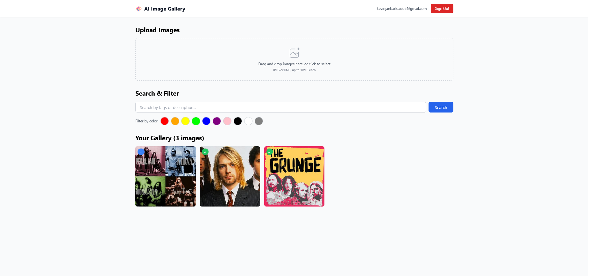

# AI Image Gallery



**Other resources:**
- [image 1](docs/images/image_1.png) 
- [image 2](docs/images/image_2.png)

**Assessment by:** Kevin Jan Barluado

An intelligent image gallery application that uses AI to analyze and categorize uploaded images. Built with React, Node.js, Supabase, and Google Gemini AI.

## Prerequisites

- Node.js version: v22.20.0
- Google Gemini API key
- Supabase account

## Quick Setup

1. **Install Dependencies**
   ```bash
   cd client && npm install
   cd ../server && npm install
   ```

2. **Setup Supabase**
   - Create a new Supabase project
   - Run `server/database/schema.sql` in Supabase SQL Editor
   - Get your Supabase URL and anon key from Project Settings > API
   - Configure redirect URL: Go to Authentication > URL Configuration and add `http://localhost:5173` to Site URL and Redirect URLs

3. **Environment Configuration**
   - Copy `.env.sample` to `.env` in both `client/` and `server/` directories
   - Fill in your environment variables:
   
   **Server (.env):**
   ```
   PORT=3000
   SUPABASE_URL=your_supabase_url
   SUPABASE_SERVICE_ROLE_KEY=your_service_role_key
   GEMINI_API_KEY=your_gemini_api_key
   ```
   
   **Client (.env):**
   ```
   VITE_SUPABASE_URL=your_supabase_url
   VITE_SUPABASE_ANON_KEY=your_supabase_anon_key
   VITE_API_URL=http://localhost:3000/api
   ```

4. **Run the Application**
   ```bash
   # Terminal 1 - Backend
   cd server && npm run dev
   
   # Terminal 2 - Frontend
   cd client && npm run dev
   ```

5. **Access the Application**
   - Frontend: http://localhost:5173
   - Backend API: http://localhost:3000/api

## Features

- Upload multiple images with drag & drop
- AI-powered image analysis using Google Gemini
- Search by tags, colors, and descriptions
- Find similar images
- Responsive gallery with pagination
- User authentication with Supabase

## AI Service Details

This project uses **Google Gemini 1.5 Flash** for image analysis:
- Free tier: 15 requests/minute, 1500 requests/day
- Generates tags, descriptions, and extracts colors
- Cost-effective: $0.075 per 1000 images after free tier

The AI processes images in the background and extracts:
- 5-10 relevant tags
- Natural language descriptions
- Dominant colors for filtering

📋 **For detailed AI service comparison and evaluation process, see:** [`docs/AI_SERVICE_COMPARISON.md`](docs/AI_SERVICE_COMPARISON.md)

## Limitations / To Do

- **Dockerization:** Container setup for easy deployment
- **Testing:** Unit tests, integration tests, E2E tests
- **Error Handling:** More comprehensive error handling and user feedback
- **Image Optimization:** WebP conversion, lazy loading
- **Offline Support:** PWA features for offline image viewing
- **Admin Panel:** User management and analytics dashboard

## Tech Stack

- **Frontend:** React, TypeScript, Vite, Tailwind CSS
- **Backend:** Node.js, Express, TypeScript
- **Database:** Supabase (PostgreSQL)
- **AI Service:** Google Gemini 1.5 Flash
- **Authentication:** Supabase Auth
- **File Storage:** Supabase Storage
